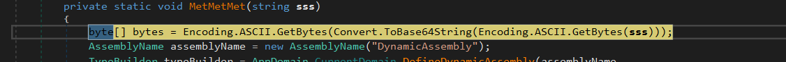

# CSHARP

- We are given a .NET framework binary that prompts for a password and tells us if we are right or wrong through a Dialogbox.


- Thus we will now open this file inside dnSpy 32-bit to decompile it.


- We see that there is a fn named 'Form1' that is doing some operations on a bytes array named bb.


- This bytes array bb is not harcoded inside the binary thus we have to seek it dynamically.

- We first set the breakpoint on the initializing instruction :


Stepping into this instruction gives us:



- This instruction converts our input into the base64 string of it and then store it into the bytes array.

- This is also the beginning of the fn "MetMetMet".

- We will step over inside the fn to go voer instruction by instruction.


- This above instruction invokes the method named "MetMett" with the arguments 'array' and our base64 encoded array 'bytes'.

- Eventually we will find the fn named 'RvkrT2' :


- This is the fn that checks our 'byte' array or simply the base64 encoding of the input.
- To solve this fn we will print the required characters inside the base64 of our input.


- By this we get our password required :


Thus the flag is :
```
dYnaaMic
```

